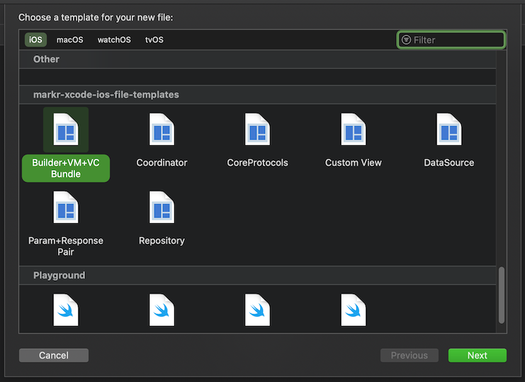

# Xcode iOS File Templates v1.0



## About
Custom xcode file templates for XIB based MVVM-C projects. These templates are standalone but are useful in conjunction with this [Xcode project template](https://github.com/markrufino/ios-base-project-lite).

## Requirements

- Xcode 11 or above

## Installation

1. Quit Xcode

2. Paste and run this on your terminal:

	```
	cd ~/Downloads
	git clone git@github.com:markrufino/markr-xcode-ios-file-templates.git
	cd markr-xcode-ios-file-templates
	sh install.sh
	cd ..
	rm -rfi markr-xcode-ios-file-templates
	```

## Usage

1. Create a new file (Command + N)

2. Look for`CoreProtocols` and use it to create the base `protocols` used by the other templates. This is only needed to be done once.

3. You can now start using the following files based on your use case: 

	- `Builder+VM+VC Bundle`: Creates four files. A view controller, its XIB, its view model, and a builder for dependency resolution.
	
	- `Coordinator`: When you need a coordinator to manage your view controllers and navigation flow. 

	- `CustomView`: When you need to create a XIB based custom view.

	- `DataSource`: Creates three files. A data source, a cell managed by that data source, and that cell's corresponding XIB file.

	- `Repository`: Call site for data related concerns, like calling an API, interacting with data from local sources, and etc.

	- `Param+Reponse`: Creates two files each cointaining a `Codable` struct. One to represent an API's request parameter and one to represent its corresponding response.


## Version History

- v1.0 (11-02-2020)
	
	- Trimmed internal references and moved to GitHub

 
## License

- MIT
